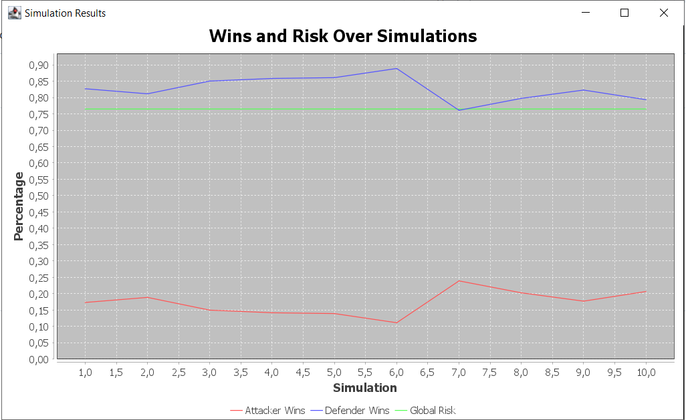

# CyberSecurityRL

Projet de simulation de cybersécurité utilisant l'apprentissage par renforcement (Q-Learning) pour modéliser les interactions entre un attaquant et un défenseur dans un réseau informatique.  
Implémenté en Java avec JavaFX pour l’interface graphique, JFreeChart pour les visualisations, et une analyse des vulnérabilités en temps réel.

---

## 🚀 Objectif du projet

Simuler un scénario réaliste de cybersécurité où un attaquant et un défenseur s’affrontent dans un réseau de 4 nœuds, chacun associé à un port courant (80, 445, 23, 443).  
Les deux agents apprennent et optimisent leurs stratégies grâce à l’algorithme Q-Learning.

---

## 🎯 Fonctionnalités principales

- **Simulation d’attaques et de défenses** avec apprentissage par renforcement (Q-Learning)
- **Interface graphique JavaFX** : visualisation des nœuds, ports, connexions, scores et vulnérabilités
- **Graphiques JFreeChart** : évolution des victoires et du risque global sur plusieurs simulations
- **Analyse de vulnérabilité en temps réel** : score par nœud, recommandations et affichage couleur
- **Simulation de ports réseau** : attribution de ports réalistes et affichage façon `netstat -an`

---

## 🛠️ Structure du code

- `Main.java` : Logique principale, interface graphique, affichage des scores et graphiques
- `Attacker.java` : Logique de l’attaquant (Q-Learning, attaques, DDoS)
- `Defender.java` : Logique du défenseur (Q-Learning, protection)
- `Simulation.java` : Orchestration des épisodes, conditions de victoire
- `NetworkEnvironment.java` : Définition du réseau, gestion des ports et connexions
- `VulnerabilityScanner.java` : Analyse et affichage des vulnérabilités

---

## 📊 Exemples de visualisation

- **Interface principale** :  
  
- **Graphique des résultats** :  
  

---

## 💡 Améliorations apportées

- Conversion complète du code Python vers Java
- Ajout d’une interface graphique moderne (JavaFX)
- Intégration de JFreeChart pour les statistiques
- Simulation réaliste des ports et de la commande `netstat -an`
- Analyse de vulnérabilité en temps réel et recommandations automatiques

---

## 📦 Installation & Lancement

1. **Cloner le dépôt**
   ```bash
   git clone https://github.com/jamaloulachgar/CyberSecurityRL.git
   cd CyberSecurityRL
   ```
2. **Compiler le projet avec Maven**
   ```bash
   mvn clean install
   ```
3. **Lancer l’application**
   ```bash
   mvn javafx:run
   ```

---

## 👨‍💻 Auteurs

- Projet adapté et amélioré par Jamal OULACHGAR en collab avec mon collègue Mohamed Amine AABID  à partir d’un projet initial en Python.

---

## 📄 Licence

Ce projet est open-source et libre d’utilisation à des fins pédagogiques.
